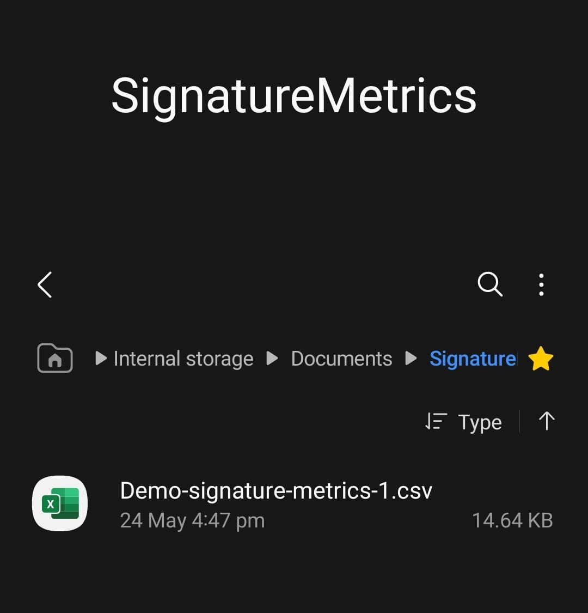

## Dynamic Signature Capture ##

So this is how the app works


* The user signs using a username which will be used in the file name for the storage of the files
* The number on top while signing is the attemt number which ranges from 1-20 to record the user attempts (used in the file name for storage as well)
* Forged option is for the dataset owners i.e us (me & my teammates) :D, to store forged attempts for DATASET purposes ONLY
* 2 types of files are saved in the form of:
    * ```<username>-signature-<attemptNo>.png```
    * ```<username>-signature-metrics-<attemptNo>.csv```

The ``.png`` file contains the image of the signauture  
The ``.csv`` file contains the fields  
- Timestamp: Stroke point time (ms)
- Stroke Number: Identifier for each stroke
- X/Y-coordinates: Stroke point position
- Velocity: Speed (pixels/sec)
- Acceleration: Rate of velocity change
- Pressure: Applied pressure
- Direction: Movement angle (°)


### Storage
Stored in the android devices internal storage itself in 2 folders (gets created if not already created):
<div align="center">
  <div style="display: inline-block; text-align: center; margin: 20px;">
    <br />
    <b>Signature Storage</b>
  </div>

  <div style="display: inline-block; text-align: center; margin: 20px;">
    <br />
    <b>Metrics Storage</b>
  </div>
</div>
